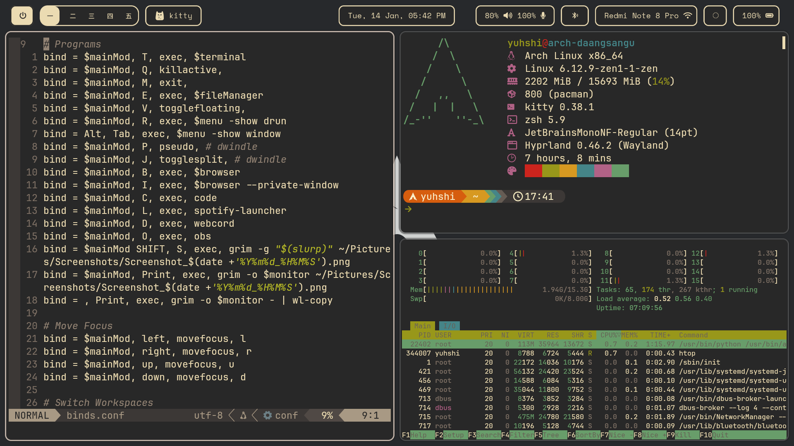

# Hyprland Dotfiles

My hyprland configurations with waybar, rofi, dunst, and more!



## Installation

You don't need to back up your existing config files since this script will backup yours first. Currently for Arch-based Distros only
```bash
git clone --depth 1 https://github.com/januarpancaran/dotfiles.git
cd dotfiles
./install.sh
```
## Battery Status Notification

If you want to set battery status notification with dunst, you might want to add these 2 files. Remember to change it with your username.

1. Cronie to check battery status every 5 minutes
```bash
crontab -e
```
If you got an error, specify your editor e.g. 'EDITOR=nvim crontab -e'.

```bash
*/5 * * * * /home/{your-username}/.local/bin/batterynotify
*/5 * * * * /usr/local/bin/mailsync >/dev/null 2>&1
@daily /sbin/trash-empty 30
```

2. Adding udev rule, e.g. /etc/udev/rules.d/99-power.rules 
```bash
ACTION=="change", SUBSYSTEM=="power_supply", ATTRS{type}=="Mains", ATTRS{online}=="1", ENV{WAYLAND_DISPLAY}="wayland-0", ENV{DBUS_SESSION_BUS_ADDRESS}="unix:path=/run/user/1000/bus" RUN+="/usr/bin/su {your-username} -c '/home/{your-username}/.local/bin/chargingnotify 1'"
ACTION=="change", SUBSYSTEM=="power_supply", ATTRS{type}=="Mains", ATTRS{online}=="0", ENV{WAYLAND_DISPLAY}="wayland-0", ENV{DBUS_SESSION_BUS_ADDRESS}="unix:path=/run/user/1000/bus" RUN+="/usr/bin/su {your-username} -c '/home/{your-username}/.local/bin/chargingnotify 0'"
```

You might want to read more info regarding this [here](https://wiki.archlinux.org/title/Udev#Triggering_desktop_notifications_from_a_udev_rule).
